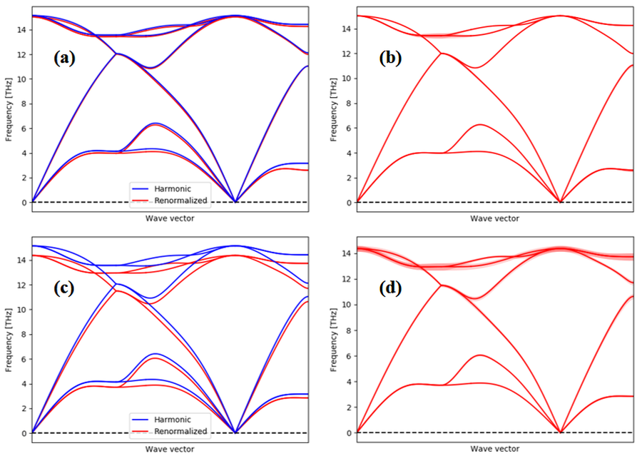
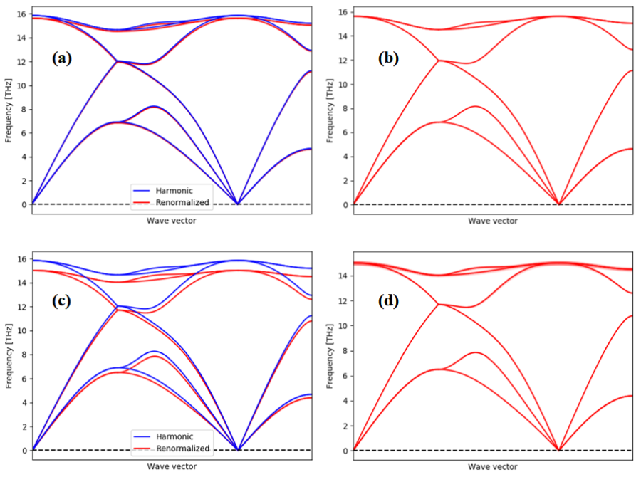
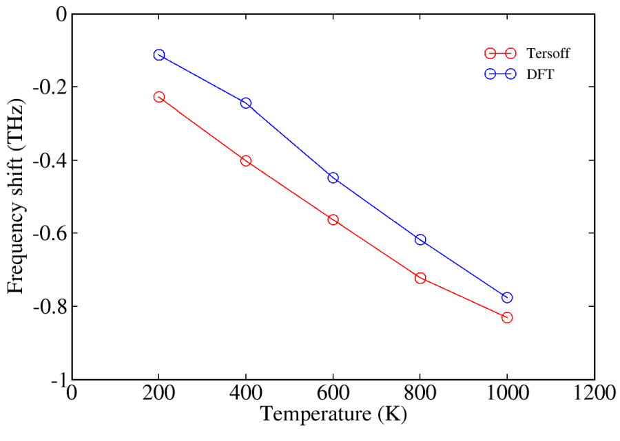
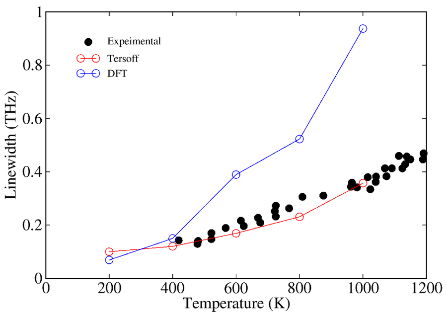

## 引言

固体中的格波由相互独立的简正模式组成。简正模式的量子称为声子，利用声子的概念可以有效地描述晶格振动。声子会影响固体的各种性质，包括铁电、超导、热电、热导等，这些宏观性质对材料在工业中的应用非常重要。简谐近似可以很好地描述低温下声子的行为，但是在高温下声子非谐效应的影响会增大。因此，研究声子的非谐效应，无论是理论上还是应用上都有非常重要的意义。

现在，计算简谐声子谱的技术已经非常成熟，但是非谐声子的计算仍在发展当中。该方向的研究是目前凝聚态领域的一个热点，目前影响较大的方法包括自洽第一性原理晶格动力学(self-consistent ab initio lattice dynamics, SCAILD)、随机自洽简谐近似(stochastic self-consistent harmonic approximation, SSCHA)、温度依赖有效势(temperature-dependent effective potential, TDEP)以及Normal Mode Decomposition方法。

本文使用密度泛函理论(Density functional theory, DFT)和经典力场(Tersoff势)进行了硅的分子动力学模拟，再通过速度自相关函数(Velocity autocorrelation function, VACF)得到倒空间中各点上不同简正模的本征值及线宽，研究了声子非谐效应导致的频率变化与温度的关系。

## 理论方法与模拟实现

简谐近似下，体系的哈密顿量是原子相对于平衡位置的偏移矢量的函数，并且具有谐振子的形式。下面说明速度自相关函数与谐振子频率的联系。

速度自相关函数的形式如下：

$$
C_{vv}(t) = \sum_i \lim_{\tau \to \infty} \int_0^\tau \mathbf{v}_i(t') \cdot \mathbf{v}_i(t'+\tau)dt'
$$

其中$\mathbf{v}_i(t)$是每个原子在时刻的速度。对于最简单的一维谐振子：

$$
H(x,p) = \frac {p^2} {2m} + \frac {1} {2} m \omega^2x^2
$$

我们可以解出$t$时刻下的位置和动量和初始值$x,p$的关系：

$$
x_t(x,p) = x \cos \omega t+ \frac {p} {m\omega} \sin \omega t
$$

$$
p_t(x,p) = p \cos \omega t- m\omega x \sin \omega t
$$

在分子动力学中，模拟时间趋于无穷时，微观量的时间平均等于系综平均，则在正则系综下一维谐振子的速度自相关函数为：
$$
C_{vv}(t) = \frac {\beta \omega} {2\pi m^2} \int_{-\infty}^{\infty}dx \int_{-\infty}^{\infty}dp[pp_t(x,p)]e^{-\beta H(x,p)}
$$

$$
= \frac {\beta \omega} {2\pi m^2} \int_{-\infty}^{\infty}dx \int_{-\infty}^{\infty}dp[p^2 \cos \omega t- m\omega xp \sin \omega t]e^{-\beta (\frac {p^2} {2m} + \frac {1} {2} m \omega^2x^2)}
$$

$$
= \frac {\beta \omega} {2\pi m^2} \cos \omega t \int_{-\infty}^{\infty}dx \int_{-\infty}^{\infty}dpp^2 e^{-\beta (\frac {p^2} {2m} + \frac {1} {2} m \omega^2x^2)} = \frac{kT}{m}\cos \omega t
$$

可以看出，速度自相关函数的频率和谐振子相同，因此它可以反映振动的所有性质。

如果要分析声子在倒空间的色散，需要把速度投影到不同的倒格矢。此外，对于晶胞含有个N原子的固体，共有3N个简正模式，总的速度自相关函数是各个简正模速度自相关函数的叠加。为了把它们分离开，需要将速度分解到相应的本征矢上。在倒格矢 $\mathbf{q}$ ，简正模$s$上的速度分量及相应的自相关函数表达式为：

$$
v_{i,\mathbf{q},s}(t) = \mathbf{v}_i(t) \exp(-i\mathbf{q}\cdot\mathbf{R}_i) \cdot \hat{\mathbf{e}}_{\mathbf{q},s}
$$

$$
C_{vv,\mathbf{q},s}(t) = \sum_i \lim_{\tau \to \infty} \int_0^\tau v_{i,\mathbf{q},s}(t') \cdot v_{i,\mathbf{q},s}(t'+\tau)dt'
$$

其中 $\hat{\mathbf{e}}_{\mathbf{q},s}$是相应的本征矢。

对速度自相关函数作傅里叶变换可以得到相应的频谱，就是声子的态密度。在简谐近似下，某一倒格矢上的频谱是多个$\delta$函数的叠加。但是在分子模拟时，原子间的相互作用必然是非谐的，因此频谱上的峰会有宽度。这种情况表示声子之间会发生散射，线宽与声子寿命相关，并且可与实验结果比较。

用分子动力学计算声子的流程是：首先计算简谐声子谱，得到各简正模的本征矢；然后进行分子动力学模拟，得到不同k点上各支声子对应的速度自相关函数，作傅里叶变换得到频谱；最后用寻峰算法分析出频谱中峰的位置，即各支声子的本征值，这样就可以得到某一温度下的非谐声子谱。

## 计算细节

本文研究了硅的声子非谐作用，计算模型是金刚石型的硅，空间群为Fd-3m ,单胞含有8个原子，晶格常数为5.45埃.我们用DFT与Tersoff势两种方法计算硅的能量和原子受力，相应的软件为VASP和LAMMPS. 计算简谐声子谱时使用Phonopy,超胞为2x2x2。分子动力学模拟同样使用的超胞，系综为NVT，温度选取为200K, 400K, 600K, 800K, 1000K.DFT计算选取步长为2fs，步数10000，Tersoff势模拟步长为1fs，步数200000.分析声子非谐效应使用DynaPhoPy.

## 结果与讨论

图1 (a)(b)200K下的DFT声子谱，(c)(d)1000K下的DFT声子谱。蓝色为简谐声子谱，红色阴影代表相应声子的线宽。
<!--  -->

<!--  -->

<!-- 图1 (a)(b)200K下的DFT声子谱，(c)(d)1000K下的DFT声子谱。蓝色为简谐声子谱，红色阴影代表相应声子的线宽。 -->

首先比较不同温度下的声子谱。

图1展示了200K和1000K下DFT计算出的声子谱，并与简谐声子谱作了对比。可以看出，200K的声子色散于简谐声子非常接近，声子线宽也很小。1000K下声子的非谐效应则变得非常明显，各支声子都出现了软化的现象，声子的展宽也更为明显。

图2 (a)(b)200K下的Tersoff声子谱，(c)(d)1000K下的Tersoff声子谱。蓝色为简谐声子谱，红色阴影代表相应声子的线宽。
<!--  -->
<!--  -->

图2展示了Tersoff势的计算结果，声子谱随温度增大的变化趋势与DFT的结果一致，但是Tersoff势的频率变化更大，声子线宽较小。

我们还计算了不同温度下 $\Gamma$ 点的长光学横波(LTO)的频率变化和声子线宽，见图3和图4。无论是DFT还是Tersoff势，LTO的频率都随温度升高而减小，这说明高温使得声子非谐效应变得更加明显。

图3 不同温度下LTO模在 $\Gamma$ 点相对简谐声子的频率变化
<!--  -->

<!--  -->

图4 不同温度下LTO模在 $\Gamma$ 点的声子线宽
<!--  -->
<!--  -->

图4展示了温度对LTO模线宽的影响，并与实验结果进行了对比。计算得到的声子线宽与温度成正比，趋势与实验一致。DFT是第一性原理计算方法，精度比Tersoff势要高很多，但是在此处的表现不如Tersoff势。这是因为DFT计算耗时很多，难以进行长时间的DFT分子动力学模拟，导致声子线宽偏大。Tersoff势的结果与实验值符合得很好，说明了它能正确地描述固体硅中的原子相互作用。

上述的Normal Mode Decomposition方法将分子动力学的原子速度投影到不同的简正模上。分子动力学轨迹包含了各阶微扰的影响，因此这种方法可以准确地计算出有限温下的声子频率位移以及线宽。但是这种方法也存在一些缺点。首先，要使计算结果收敛，需要进行长时间的模拟，这对第一性原理分子动力学是一个很大的挑战。其次，简正模由简谐声子计算得到，而在高温下，用简谐声子模式投影可能不是最好的选择。

（本文是2018年“蓝火计划”的调研报告，有修改）

## 参考文献

1. Souvatzis, P., Eriksson, O., Katsnelson, M. I. & Rudin, S. P. Entropy Driven Stabilization of Energetically Unstable Crystal Structures Explained from First Principles Theory. Physical Review Letters  100, (2008).

2. Souvatzis, P., Eriksson, O., Katsnelson, M. I. & Rudin, S. P. The self-consistent ab initio lattice dynamical method. Computational Materials Science  44, 888–894 (2009).

3. Errea, I., Calandra, M. & Mauri, F. Anharmonic free energies and phonon dispersions from the stochastic self-consistent harmonic approximation: Application to platinum and palladium hydrides. Physical Review B  89, (2014).

4. Hellman, O., Abrikosov, I. A. & Simak, S. I. Lattice dynamics of anharmonic solids from first principles. Phys. Rev. B  84, 180301 (2011).

5. Hellman, O. & Abrikosov, I. A. Temperature-dependent effective third-order interatomic force constants from first principles. Phys. Rev. B  88, 144301 (2013).

6. Sun, T., Zhang, D.-B. & Wentzcovitch, R. M. Dynamic stabilization of cubic CaSiO$_3$ perovskite at high temperatures and pressures from ab initio molecular dynamics. Phys. Rev. B  89, 094109 (2014).

7. Zhang, D.-B., Sun, T. & Wentzcovitch, R. M. Phonon Quasiparticles and Anharmonic Free Energy in Complex Systems. Physical Review Letters  112, (2014).

8. Carreras, A., Togo, A. & Tanaka, I. DynaPhoPy: A code for extracting phonon quasiparticles from molecular dynamics simulations. Computer Physics Communications  221, 221–234 (2017).

9. Tersoff, J. New empirical approach for the structure and energy of covalent systems. Phys. Rev. B  37, 6991–7000 (1988).

10. Kresse, G. & Furthmüller, J. Efficient iterative schemes for ab initio total-energy calculations using a plane-wave basis set. Phys. Rev. B  54, 11169–11186 (1996).

11. Plimpton, S. Fast Parallel Algorithms for Short-Range Molecular Dynamics. Journal of Computational Physics  117, 1–19 (1995).

12. Togo, A. & Tanaka, I. First principles phonon calculations in materials science. Scr. Mater.  108, 1–5 (2015).

13. Balkanski, M., Wallis, R. F. & Haro, E. Anharmonic effects in light scattering due to optical phonons in silicon. Phys. Rev. B  28, 1928–1934 (1983).

